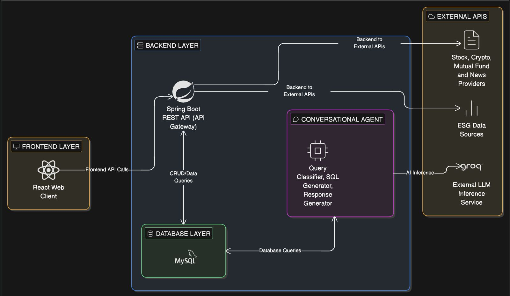
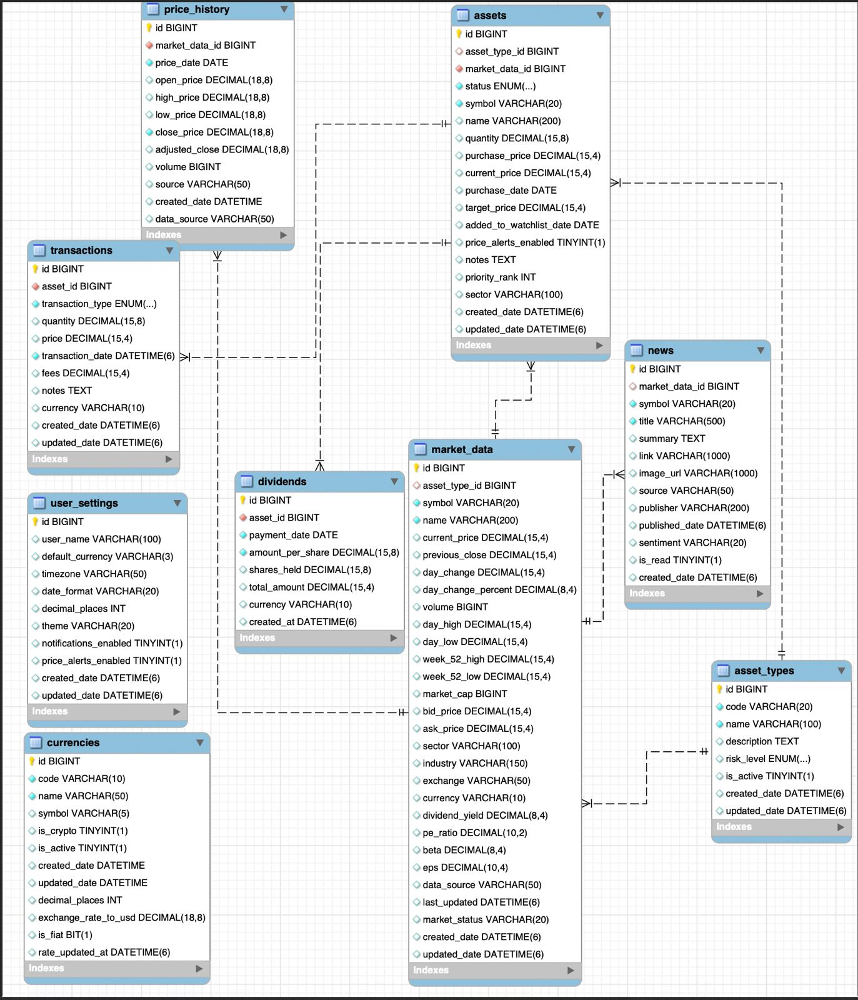

# PortfolioX — AI-Powered Financial Portfolio Management System

<div align="center">


**The Silicon Cartel** — Tilak, Rudra, Vaishnavi, Deekshitha

*A comprehensive, multi-asset portfolio management platform with AI-powered insights and natural language querying capabilities.*

</div>

---

## Table of Contents

- [The Problem We Solve](#-the-problem-we-solve)
- [Our Solution](#-our-solution)
- [System Architecture](#-system-architecture)
- [Database Design](#-database-design)
- [Technology Stack](#-technology-stack)
- [Design Decisions](#-design-decisions)
- [API Overview](#-api-overview)
- [Getting Started](#-getting-started)
- [Project Structure](#-project-structure)
- [Roadblocks](#-roadblocks)

---

## The Problem We Solve

### The Challenge of Modern Portfolio Management

Managing a diversified investment portfolio in today's financial landscape presents several challenges:

1. **Fragmented Information**: Investors must track multiple asset classes (stocks, bonds, crypto, ETFs, mutual funds) across different platforms with no unified view.

2. **Data Overload**: Financial data from various sources (Yahoo Finance, CoinGecko, Finnhub) is scattered, making it difficult to get a holistic portfolio perspective.

3. **Complex Analysis**: Calculating portfolio performance, risk metrics (Sharpe ratio, VaR, volatility), and making informed decisions requires technical expertise most retail investors lack.

<!-- 4. **Real-Time Monitoring**: Markets move fast. Manual tracking of price changes, news sentiment, and ESG ratings is time-consuming and error-prone. -->

4. **Natural Language Barrier**: Traditional portfolio tools require learning complex interfaces. Users can't simply ask "How is my tech portfolio performing?" or "What's my dividend income this year?"

5. **Sustainability Blindspot**: ESG (Environmental, Social, Governance) factors are increasingly important, but most tools don't integrate sustainability metrics into investment decisions.

---

## Our Solution

**PortfolioX** is an end-to-end portfolio management system that addresses these challenges through:

### Unified Multi-Asset Management
- Track **stocks, ETFs, bonds, cryptocurrency, mutual funds, and cash** in a single dashboard
- Real-time price updates from multiple data providers
- Unified transaction history and dividend tracking

### AI-Powered Natural Language Interface
- **Chat with your portfolio** using plain English
- Ask questions like:
  - "What's my total portfolio value?"
  - "Show me my best performing stocks"
  - "Which assets have high ESG scores?"
  - "What dividends did I receive last quarter?"
- Powered by **Groq LLM** for fast, intelligent responses

### ESG Integration
- Environmental, Social, and Governance scores for all holdings
- Controversy level tracking
- Filter investments by sustainability criteria

### Market Intelligence
- Aggregated financial news with AI summaries.
- News filtered by your portfolio holdings
- Read/unread tracking for important updates

---

## System Architecture



### Component Responsibilities

| Component | Technology | Port | Responsibility |
|-----------|------------|------|----------------|
| **Frontend** | React + TypeScript + Tailwind | 8080 | User interface, visualizations, user interactions |
| **Backend API** | Spring Boot (Java 17) | 5500 | REST API, business logic, data persistence |
| **Chatbot Service** | Flask (Python) | 5000 | NLP query processing, SQL generation, AI responses |
| **Database** | MySQL 8.0 | 3306 | Data persistence, relational data storage |
| **Data Fetchers** | Python Scripts | N/A | External API integration, data population |

---

## 🗄 Database Design

### Entity Relationship Diagram


### Core Tables (12)

| Table | Purpose | Key Fields |
|-------|---------|------------|
| `asset_types` | Asset category definitions | STOCK, ETF, CRYPTO, BOND, CASH, MUTUAL_FUND |
| `assets` | User's portfolio holdings | symbol, quantity, purchase_price, status |
| `market_data` | Real-time market prices | current_price, day_change, volume, pe_ratio |
| `price_history` | Historical OHLCV data | open, high, low, close, adjusted_close, volume |
| `transactions` | Buy/sell transaction log | transaction_type, quantity, price, fees |
| `dividends` | Dividend payment history | amount_per_share, payment_date, total_amount |
| `esg_ratings` | ESG sustainability scores | environment, social, governance scores |
| `news` | Financial news articles | title, summary, sentiment, source |
| `technical_indicators` | RSI, MACD, Bollinger, etc. | 25+ technical indicators per price point |
| `stock_summary` | Aggregated statistics | returns, volatility, Sharpe ratio, VaR |
| `user_settings` | User preferences | theme, currency, notifications |
| `currencies` | Currency reference data | code, exchange_rate, is_crypto |

---

## Technology Stack

### Frontend
| Technology | Purpose |
|------------|---------|
| **React 18.3** | UI component library |
| **TypeScript 5.8** | Type-safe JavaScript |
| **Tailwind CSS** | Utility-first styling |
| **Vite** | Build tool and dev server |
| **Recharts** | Data visualization |
| **Radix UI** | Accessible component primitives |
| **React Query** | Server state management |
| **React Router** | Client-side routing |

### Backend
| Technology | Purpose |
|------------|---------|
| **Spring Boot 4.0.2** | REST API framework |
| **Java 17** | Backend language |
| **Spring Data JPA** | ORM and data access |
| **Flyway** | Database migrations |
| **MySQL 8.0** | Relational database |
| **Spring Actuator** | Health monitoring |

### AI/Chatbot Service
| Technology | Purpose |
|------------|---------|
| **Flask** | Python web framework |
| **Groq LLM** | Fast AI inference |
| **mysql-connector-python** | Database connectivity |
| **Custom SQL Generator** | Natural language to SQL |

### Data Pipeline
| Technology | Purpose |
|------------|---------|
| **Python 3.8+** | Data fetching scripts |
| **yfinance** | Yahoo Finance API wrapper |
| **CoinGecko API** | Cryptocurrency data |
| **Finnhub API** | Stock news and ESG data |

---

## Design Decisions


### 1. **Why Cache External API Data?**

**Decision**: Store all external API data (prices, news, ESG) in our database rather than fetching on-demand.

**Rationale**:
- **Rate Limiting**: Free API tiers have strict limits (Yahoo: 100/hour, CoinGecko: 30/min)
- **Performance**: Sub-millisecond database queries vs 200-500ms API calls
- **Reliability**: Application works even when external APIs are down
- **Historical Analysis**: We need historical data that APIs may not retain
- **Consistency**: Same data shown across all users and sessions

### 2. **Why Separate Chatbot Service?**

**Decision**: Run the chatbot as a separate Flask microservice rather than embedding in Spring Boot.

**Rationale**:
- **Language Fit**: Python excels in NLP/ML tasks with better library support (Groq SDK, prompt engineering)
- **Independent Scaling**: Chatbot can scale separately from main API under heavy AI load
- **Fault Isolation**: Chatbot failures don't crash the main application
- **Development Speed**: Python allows rapid prototyping for AI features
- **Future-Proofing**: Easy to swap LLM providers (OpenAI, Anthropic, local models)


### 3. **Why Unified Assets Table with Nullable Fields?**

**Decision**: Single `assets` table with nullable asset-specific columns instead of separate tables per asset type.

**Rationale**:
- **Simpler Queries**: Portfolio totals don't require JOINs across multiple tables
- **Unified API**: One endpoint handles all asset types
- **Easier Maintenance**: Adding new asset types doesn't require schema changes
- **Trade-off Accepted**: ~30% nullable fields, but worth it for query simplicity
- **Extensibility**: New asset-specific fields can be added without breaking changes


### 4. **Why React with TypeScript**

**Decision**: TypeScript over vanilla JavaScript for the frontend.

**Rationale**:
- **Type Safety**: Catch errors at compile time, not runtime
- **Better IDE Support**: Autocomplete, refactoring, go-to-definition
- **Modular Nature**: React is inherently modular, easier to collaborate.
- **Better Community Support**: React has better documentation, broader adoption, and extensive ecosystem resources
- **Team Scalability**: Easier onboarding for new developers

---

## API Overview

The backend exposes **123 REST endpoints** across 9 controllers:

| Controller | Base Path | Endpoints | Purpose |
|------------|-----------|-----------|---------|
| **Assets** | `/api/assets` | 14 | Portfolio holdings, buy/sell, watchlist |
| **Market Data** | `/api/market-data` | 10 | Real-time prices, search, gainers/losers |
| **Technical Indicators** | `/api/technical-indicators` | 12 | RSI, MACD, Bollinger Bands, MAs |
| **Stock Summary** | `/api/stock-summary` | 12 | Returns, volatility, risk metrics |
| **Transactions** | `/api/transactions` | 8 | Buy/sell history, gains/losses |
| **Dividends** | `/api/dividends` | 10 | Dividend tracking, income reports |
| **ESG Ratings** | `/api/esg-ratings` | 18 | Sustainability scores, filtering |
| **News** | `/api/news` | 22 | Financial news, sentiment, sources |
| **User Settings** | `/api/user-settings` | 15 | Preferences, notifications, themes |
| **Chat** | `/api/chat` | 2 | AI chatbot interface |

**Full API documentation**: See [API_ENDPOINTS.md](portfolioapp/API_ENDPOINTS.md)

---

## Getting Started

### Prerequisites

- Java 17+
- Node.js 18+
- MySQL 8.0+
- Python 3.8+
- Maven 3.6+

### Quick Start (Automated)

```bash
# Clone the repository
git clone <repository-url>
cd neueda_project

# Set database credentials
export DB_USER=root
export DB_PASSWORD=your_password

# Run initialization script
./init_database.sh
```

### Manual Setup

#### 1. Database Setup
```bash
mysql -u root -p
```
```sql
DROP DATABASE IF EXISTS portfolio_db;
CREATE DATABASE portfolio_db;
```

#### 2. Backend (Spring Boot)
```bash
cd portfolioapp
./mvnw spring-boot:run
# Runs on http://localhost:5500
```

#### 3. Populate Data
```bash
cd portfolioapp/python-scripts
pip install -r requirements.txt

python populate_stocks.py
python populate_mutual_funds.py
python populate_esg.py
python populate_crypto.py
python populate_news.py
python historical_price.py
python populate_user_assets.py
```

#### 4. Chatbot Service
```bash
cd portfolioapp/chatbot-service
pip install -r requirements.txt
export GROQ_API_KEY=your_groq_api_key
python app.py
# Runs on http://localhost:5000
```

#### 5. Frontend
```bash
cd financial-portfolio-frontend
npm install
npm run dev
# Runs on http://localhost:5173
```

---

## Project Structure

```
neueda_project/
├── README.md                          # This file
├── init_database.sh                   # Automated setup script
│
├── financial-portfolio-frontend/      # React Frontend
│   ├── src/
│   │   ├── components/               # Reusable UI components
│   │   │   ├── dashboard/           # Dashboard widgets
│   │   │   ├── layout/              # Layout components
│   │   │   └── ui/                  # Base UI components
│   │   ├── pages/                   # Page components
│   │   │   ├── Dashboard.tsx
│   │   │   ├── Assets.tsx
│   │   │   ├── Chat.tsx
│   │   │   ├── Insights.tsx
│   │   │   └── Settings.tsx
│   │   ├── context/                 # React context providers
│   │   ├── hooks/                   # Custom React hooks
│   │   ├── types/                   # TypeScript type definitions
│   │   └── lib/                     # Utility functions
│   ├── package.json
│   └── vite.config.ts
│
└── portfolioapp/                      # Spring Boot Backend
    ├── src/main/java/.../
    │   ├── controller/              # REST API endpoints
    │   ├── service/                 # Business logic
    │   ├── repository/              # Data access layer
    │   ├── entity/                  # JPA entities
    │   ├── dto/                     # Data transfer objects
    │   └── config/                  # Configuration classes
    ├── src/main/resources/
    │   ├── db/migration/            # Flyway migrations
    │   └── application.properties
    │
    ├── chatbot-service/              # Python AI Service
    │   ├── app.py                   # Flask application
    │   ├── chatbot_service.py       # Main service logic
    │   ├── query_classifier.py      # Query type detection
    │   ├── sql_generator.py         # NL to SQL conversion
    │   ├── explanation_generator.py # Response formatting
    │   └── prompts.py               # LLM prompts
    │
    ├── python-scripts/               # Data Population Scripts
    │   ├── populate_stocks.py
    │   ├── populate_crypto.py
    │   ├── populate_esg.py
    │   ├── populate_news.py
    │   ├── historical_price.py
    │   └── populate_user_assets.py
    │
    ├── architecture/                 # Design Documentation
    │   ├── requirements.md
    │   └── database-design.md
    │
    └── pom.xml
```

---

## Roadblocks

<!-- 
Document any challenges, blockers, or known issues here.
This section will be filled in as the project progresses.
-->

### Current Blockers
- [ ] *To be filled*

### Known Issues
- [ ] *To be filled*

### Technical Debt
- [ ] *To be filled*

### Future Improvements
- [ ] *To be filled*

---

## 📄 License

This project was developed as part of the Neueda Training Program.

---

<div align="center">

**Built by The Silicon Cartel**

*Tilak • Rudra • Vaishnavi • Deekshitha*

</div>
